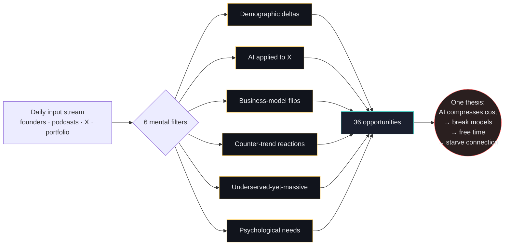
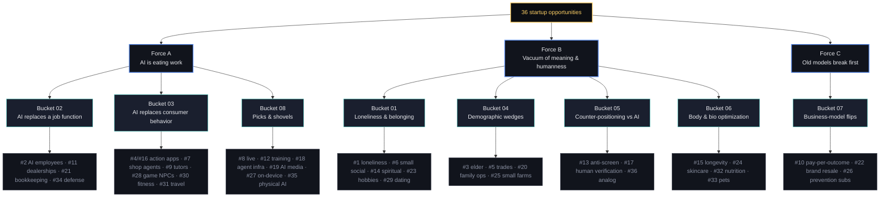
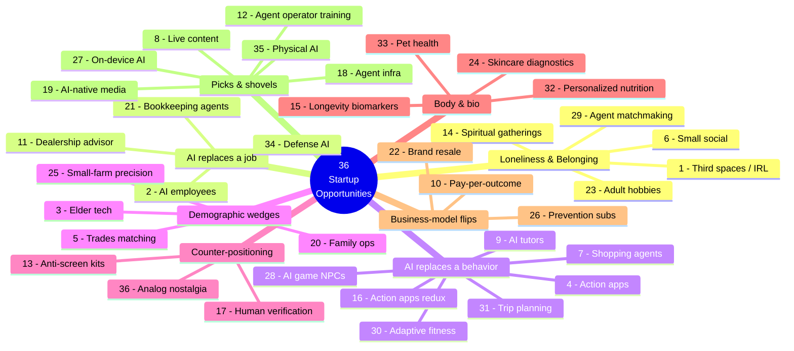
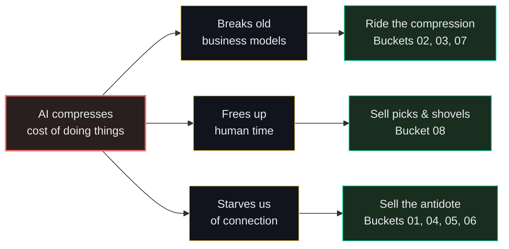

# The 36 Startup Opportunities — Diagrams

Three views of Greg Eisenberg's 36-idea list:
1. **Methodology flow** — how the list was generated
2. **Master-forces hierarchy** — 3 forces → 8 buckets → 36 ideas
3. **Mindmap** — full radial layout

---

## 1. How the list was generated (methodology)

---

## 2. Master-forces hierarchy

---

## 3. Mindmap — full radial layout

---

## 4. The compressed thesis

